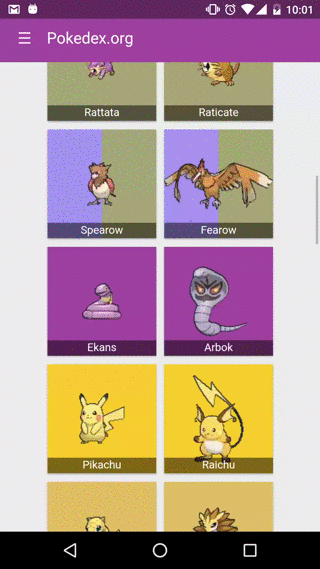

> * 原文链接 : [Introducing Pokedex.org: a progressive webapp for Pokémon fans — Pocket JavaScript](http://www.pocketjavascript.com/blog/2015/11/23/introducing-pokedex-org)
* 原文作者 : [NOLAN LAWSON](http://www.pocketjavascript.com/?author=539b3a09e4b0dc27b9618c7a)
* 译文出自 : [掘金翻译计划](https://github.com/xitu/gold-miner)
* 译者 : RobertWang
* 校对者: [达仔(*/ω＼*)](https://github.com/Zhangjd)
* 状态 : Translating


# Pokedex.org 给口袋妖怪爱好者的 web app 的技术选型

众所周知，移动网络背负着速度慢的坏名声，但在如何修复的问题上并不缺少不同的意见。

近日，`Jeff Atwood` 令人信服地论证了[在Android设备上的单线程JavaScript的状态表现差](https://meta.discourse.org/t/the-state-of-javascript-on-android-in-2015-is-poor/33889)。然后 `Henrik Joreteg` 也质疑[JavaScript框架的在移动端生存能力](https://joreteg.com/blog/viability-of-js-frameworks-on-mobile)，他说对于在移动网络上运行像 `Ember` 和 `Angular` 的(这样的)框架是太过臃肿。(为了后续良好的讨论，请参见[这些](https://aerotwist.com/blog/the-cost-of-frameworks/), [文章](http://tomdale.net/2015/11/javascript-frameworks-and-mobile-performance/))

观点陈述：`Atwood` 说，问题是单线程; `Joreteg` 说，问题是移动网络。我认为他们都是对的。就像做 `Android` 开发与做 `web` 开发的人差不多，我会直接告诉你网络和并发能力这两方面是当我写一份原生应用的性能表现时最关心的问题。

问任何 `iOS` 或 `Android` 开发者，怎样使我们的应用更快，极有可能你将听到以下两个主要的策略：

1.  **禁用网络通话** 即使是在较好的 `3G` 或 `4G` 连接状态下，健谈的网络活动将使移动应用严重损失性能。让用户盯着加载进度并不是良好的用户体验。
2.  **使用后台线程** 要产生 60`FPS` 的流畅感，你在主线程上的操作必须少于 16ms。任何与 UI(用户界面) 不相关的工作都将转交给一个后台线程去完成。

我认为 `web` 作为原生应用能够解决这些问题，只是大多数 `Web` 开发人员不知道这些工具就在外面。对于网络和并发性的问题，`web` 有两个非常好的答案：
我认为以web的能力能像native apps那样解决这些问题，只是大多数web开发者不知道工具就在那儿。

1. 离线优先（比如IndexedDB和ServiceWorkers)
2. Web workers

我决定将这些想法放在一起，构建一个和native app一样引人注目的，有丰富交互体验的webapp，但它 “仅仅” 是一个网站。根据 Chrome 小组的准则，我构建了 [Pokedex.org](http://pokedex.org) - 一个离线工作的[先进的网页应用(progressive webapp)](https://infrequently.org/2015/06/progressive-apps-escaping-tabs-without-losing-our-soul/)，它可以从主屏幕启动，甚至在普通的 `Android` 手机上运行在 60FPS。这篇博客文章将解释我是如何做到的。


## 口袋妖怪 - 一个雄心勃勃的目标

对于那些不知道口袋妖怪世界的人们，一个图鉴包含数以百计的可爱的小生物，以及他们的属性，类型，进化和移动信息的百科全书。按照一个儿童游戏的规则，其数据量大得令人惊叹(假如你希望烧脑，可以通过仔细研究[努力值](http://bulbapedia.bulbagarden.net/wiki/Effort_values))。所以这是一个雄心勃勃的Web应用程序的理想目标。


[查看原文视频](http://nolanlawson.s3.amazonaws.com/vid/DeliriousNeedyAnophelesmosquito.mp4)

第一个问题是获取数据，这个很容易，多亏了精彩的[Pokéapi](http://pokeapi.co/)。第二个问题是，如果我们希望应用程序脱机工作，数据库过于庞大，不能保持在内存中，所以我们需要巧妙地使用使用 `IndexedDB` 和/或 `ServiceWorker`。

这个程序，我决定使用[PouchDB]（http://pouchdb.com/）保存口袋妖怪数据（因为它擅长同步），同时使用[LocalForage](https://github.com/mozilla/localForage)作为应用的状态数据存储（因为它有一个很好的键值API(key-value API)）。 `PouchDB` 和 `LocalForage` 都在 `web worker` 中使用 `IndexedDB`，这意味着任何数据库操作者将是[完全无阻塞](http://nolanlawson.com/2015/09/29/indexeddb-websql-localstorage-what-blocks-the-dom/)。

然而，事实是在第一次加载网站时口袋妖怪数据是不能马上使用的，因为它需要一段时间来从服务器同步。所以，我还使用了回退策略“优先本地，然后才是远端”：


在网站第一次加载时，PouchDB开始从远端数据库同步，在我的项目中使用的是[Cloudant](http://cloudant.com/)（一个CouchDB即服务的提供者）。由于 `PouchDB` 具有本地和远程两套API，可以很容易地从本地数据库查询，如果失败再回退到远程数据库：

 ```
 async function getById() {
   {
    return await localDB.();
  } catch () {
    return await remoteDB.();
  }
 }
 ```

（是的，在这个应用中我也决定使用[ES7 async/await](http://pouchdb.com/2015/03/05/taming-the-async-beast-with-es7.html)，使用[Regenerator](https://github.com/facebook/regenerator)和[Babel](http://babeljs.io/)，通过最小化/gzip压缩构建后的大小增加了小于 4KB ，所以对于方便开发者，这样做还是非常值得的。）

所以当该网站第一次加载，这是一个相当标准的 `AJAX` 应用，使用 `Cloudant` 获取和显示数据。一旦同步完成（在较好的连接状态下只需要几秒钟），所有交互将成为纯粹的本地访问，这意味着它们(运行的)更快并且能脱机工作。这是实现应用“先进的”体验的途径之一。

## 我喜欢你的工作方式


我还在这个应用中大量引入[web worker](http://www.html5rocks.com/en/tutorials/workers/basics/)。一个 `web worker` 的本质是一个后台线程，你可以访问除了 `DOM` 之外，浏览器中几乎所有的 `API`，在 `worker` 执行时不会阻塞 `UI`，这有益于你要做的任何事情。

从[web worker](http://www.html5rocks.com/en/tutorials/workers/basics/) [文献](http://ejohn.org/blog/web-workers/)了解 `web worker`，可能你误以为 `web worker` 作用仅仅是有限的校验、解析和其他费时的计算任务。然而，事实上`Angular 2`正计划一种架构，
[让`web worker`几乎存活在整个应用生命周期](https://docs.google.com/document/d/1M9FmT05Q6qpsjgvH1XvCm840yn2eWEg0PMskSQz7k4E)，这在个理论上能够提高并行并减少 `jank`，特别是在移动端。类似技术 [Flux](https://medium.com/@nsisodiya/flux-inside-web-workers-cc51fb463882#.ooz0ho5si) 和 [Ember](http://blog.runspired.com/2015/06/05/using-webworkers-to-bring-native-app-best-practices-to-javascript-spas/) 也在探索，尽管现在还没有实质结果。

>	这样做是为了整个应用应该运行在[一个 `web worker`]中，并将渲染指令发送给 `UI` 端。
— Brian Ford, Angular 核心开发者
([来源](https://twitter.com/briantford/status/649332944478171136))

因为我喜欢生活在最前沿，我决定对 `Angular 2` 的概念进行一个测试，并几乎将整个应用程序运行在内部的 `web worker` 上，将 `UI` 线程的责任限制在渲染和动画方面。从理论上讲，这应该最大限度地提高并行能力并榨取多核智能手机的所有价值，解决 `Atwood` 关于单线程的 JavaScript 性能问题。

我仿效 `React`/`Flux` 对应用架构，但在这个案例中，我使用的是较低级别的[虚拟DOM(virtual-dom)](https://github.com/Matt-Esch/virtual-dom)，还有一些我写的辅助库，[vdom-as-json](https://github.com/nolanlawson/vdom-as-json)和[vdom-serialized-patch](https://github.com/nolanlawson/vdom-serialized-patch)，它可以将 `DOM` 以补丁的形式序列化为 `JSON`，使这些补丁可以从 `web worker` 发送到主线程。基于[与 `IndexedDB` 规范的作者 `Joshua Bell`咨询](https://code.google.com/p/chromium/issues/detail?id=536620#c11)的建议，与 `worker` 通讯过程的中我用的也是 `JSON` 字符串。

该应用程序的结构如下所示：


需要注意的是，整个 “`Flux`” 的应用可以在 `web worker` 里面，同样还有“渲染”、“差异”和一部分“渲染/差异/补丁”管道，因为这些操作都没有依赖 `DOM`。唯一需要在 `UI` 线程上做的事情就是补丁，也就是要使用的 `DOM` 指令最小集合。而且，由于此补丁操作（通常）较少，序列化的成本可以忽略不计。

为了说明这一点，这里有一个从 `Chrome` 探查记录中得到的时间表，使用的是 `Nexus5` `Android5.1.1` 上运行的 `Chrome47`。时间线从用户点击一个口袋妖怪列表中的那一刻开始，也就是当“详情”面板的被打上补丁，然后向上滑动进入到视图中：


（应用`patch`和计算`FLIP`动画之间的延迟是有意而为的，目的是为了播放“波动”的动画。）

需要重点注意的一点是，`UI` 线程在用户监听与应用补丁之间都是完非阻塞的。此外，补丁在(`JSON.parse()`)反序列化时也是微不足道的；它甚至不时间轴上记录。
重要的是，UI线程从用户点击屏幕到应用patch之间，完全没有阻塞。另外，patch 的反序列化 (`JSON.parse()`)操作时间短到甚至没有出现在时间轴上。我也为单次请求测量了 `worker` 自身的开销，通常在5-15ms范围（虽然它最高峰偶尔高达200毫秒）。

现在让我们看看去掉 `worker` ，并把这些业务放回到 `UI` 线程上会是什么样子：


哇耐莉，有很多的操作发生在 `UI` 线程上！除了 `IndexedDB` 引入了一些轻微的 `DOM` 阻塞，同样还有渲染/差异对比的操作，明显比使用补丁代价更高。

您还会注意到，这两个版本大约需要相同的时间（300-400ms），但前者比后者阻塞 `UI` 线程的更少。在我的例子中，我使用 `GPU` 加速的 `CSS` 动画，所以你不会注意到两种方式太大的差别。但你可以设想下，在一个更复杂的应用中，可能有很多JS逻辑同时抢着占用UI线程（比如，第三方广告、滚动效果等等）这个技巧就意味着UI卡顿和平滑的区别了。

## 先进的渲染

虚拟的DOM的另一个好处是，我们可以在服务器端预先渲染应用的初始状态。我使用[vdom-to-html](https://github.com/nthtran/vdom-to-html/)渲染排在前面的30个口袋妖怪，把`HTML`直接内嵌到页面中。 （把HTML内嵌到我们的HTML中！是怎样一个概念。）虚拟 `DOM` 在客户端重新合成，它和使用[vdom-as-json](https://github.com/nolanlawson/vdom-as-json)建立初始的虚拟DOM状态一样简单。


禁用JavaScript的Pokedex.org效果。

同样，我也内嵌了最关键的 `CSS` 和 `JavaScript`，非关键的 `CSS` 的异步加载得益于[pretty nifty hack](http://stackoverflow.com/a/32614409/680742)。在[pouchdb-load](https://github.com/nolanlawson/pouchdb-load)插件也被充分利用于更快的初始复制。

关于托管，我只是把静态文件放在[Amazon S3](https://aws.amazon.com/s3/)上，使用[Cloudflare](https://www.cloudflare.com/)提供的SSL。 （ServiceWorkers需要SSL。）`Gzip`、缓存头和`SPDY`都是 `CloudFlare` 自动处理的。

在Chrome的开发工具使用2G网络的节流中测试，站点设法在5秒钟内得到 `DOMContentLoaded`，首次绘制大约用2秒钟完成。这意味着在JavaScript是被加载的同时，用户至少能看到_一部分内容_，这大大地改善网站感观上的性能。

“在 `web worker` 中执行一切”的做法也有助于用渐进式渲染，因为大多数与 `UI` 相关的 `JavaScript`（点击动画，侧边菜单的行为等），可以在一个小的 `JavaScript` 的初始包进行加载，反之，而更大的“框架”包只在 `web worker` 启动时加载。在我的案例中，用户界面包体积在压缩后有24KB，而 `worker` 包是90KB。这意味着，在整个“框架”下载的时候，在网页上至少有一些小的 `UI` 不断地丰富起来。

当然了，`ServiceWorker` 也存储所有静态的“应用外壳”(资源) - HTML，CSS，JavaScript和图像。我使用的是 `先本地后远程` 策略，以确保最佳的离线体验，代码主要是从`Jake's Archibald`优美的[SVGOMG](https://github.com/jakearchibald/svgomg)中借来的（当然，其实是偷来的）代码。就像`SVGOMG`那样，应用也会弹出一个`toast`消息，提示用户app工作在离线状态，以消除用户疑虑。 （这是新的技术，用户需要了解一下吧！）


[查看原文视频](http://nolanlawson.s3.amazonaws.com/vid/offline-pokedex.mp4)

归功于`ServiceWorker`，后续的页面加载完全不会受到网络限制。因此首次访问后，整个站点完全本地化了，这意味着页面可以在一秒钟不到以内渲染出来。（根据设备速度，可能会比这稍慢。）

## 动画

因为我的目标是让应用跑在 60FPS 上，甚至是低端机，为此我选择了 `Paul Lewis` 著名的[FLIP 技术](https://aerotwist.com/blog/flip-your-animations/)处理动态的动画，只使用硬件加速的 `CSS` 属性（即`transform`和`opacity`）。结果是这样美丽[material design](https://www.google.com/design/spec/material-design/introduction.html)风格的动画，它运行得很好，甚至在我早期的 `Galaxy Nexus` 的手机上：


[查看原文视频](http://nolanlawson.s3.amazonaws.com/vid/SlimySelfishHermitcrab.mp4)

关于`FLIP`动画最好的部分是，结合了JS的灵活性和 CSS动画的性能。因此，尽管口袋妖怪的初始状态是不预先确定，我们的动画依然可以从列表的任意位置变换到某个详细视图的固定位置，我们也可以并行运行许多动画 - 注意到该背景填充，子画面的运动，并且面板滑动三个独立的动画。

我与 `Lewis` 的`FLIP`算法唯一不同，也仅仅是稍微不同，是口袋妖怪的的动画。因为原图和目标图的位置摆放都不利于动画实现，为此我不得不创建第三个精灵，绝对定位在身体内，在两者之间过渡时作为幌子。

## 技巧

当然，如果你没有密切注视Chrome分析工具，并时常用真机检验你的假设，任何webapp都可能会变慢。一些我碰到的问题：

1. `CSS sprites` 能很好的减少负荷大小，但他们由于过多的内存使用拖慢应用。我最终选择使用内联Base64。
2. 我需要一个高性能的滚动列表，而我从[Ionic collection-repeat](http://ionicframework.com/blog/collection-repeat/)，[Ember list-view](https://github.com/emberjs/list-view)和[Android ListView](https://developer.android.com/guide/topics/ui/layout/listview.html)获得了一些灵感，构建一个简单的 `<ul>` 那_仅仅_是用来呈现并保存这些 `<li>` 的可见视图。这样减少了内存的使用，让动画和触摸交互更加迅捷。再一个，所有列表的计算和差异都是在 `web worker` 内部完成，所以滚动效果能保持流畅。这一点也适用于将多达649个口袋妖怪一次显示。
3. 仔细地选择你你用的库！我使用[MUI](http://muicss.com/)作为我的“素材” `CSS` 库，这是在非常棒的引导，但可悲的是我发现它基本没有做性能优化。所以，最后我不得不自己重构了部分代码。例如，侧面菜单最初是使用 `margin-left` 而不是 `transform`，从而导致[在移动设备上的难伺候的动画(janky animations on mobile)](https://youtu.be/Q-nxiBNxCA4)。
4. 事件监听器是一种威胁。`MUI`一度给每个`<li>`标签添加事件监听（为了"水波纹"效果），尽管使用了硬件加速CSS动画，但还是因为内存占用问题导致速度变慢。幸运的是，Chrome浏览器开发工具中有一个“显示滚动优先的问题(Show scrolling perf issues)”复选框，立即就发现了问题：


作为这个问题的一个变通方案，我把一个事件监听绑定到整个`<ul>`上，`<ul>`负责展现每个`<li>`标签的水波纹动画(事件委托)。

## 浏览器支持

事实证明，很多我上面提到的API不能完美地支持所有浏览器。最值得注意的是，在Safari、iOS、IE或Edge中 `ServiceWorker` 是不可用的。 （Firefox很快将在 nightly 版本中交付。）这意味着离线功能将不会在这些浏览器上正常工作 - 如果你没有连接的情况下刷新了页面，内容将不存在了。

我遇到的另一个障碍是[Safari不支持在`web worker` 中 使用`IndexedDB`(Safari does not support IndexedDB in a web worker)](https://bugs.webkit.org/show_bug.cgi?id=149953)，这意味着我不得不写一个解决办法，以避免 `web worker` 在Safari，只是使用通过 `WebSQL` 来使用 `PouchDB`/`LocalForage`。 Safari 也还是有350毫秒延迟，我选择不去[修复快速点击(FastClick hack)](https://github.com/ftlabs/fastclick) 的问题，因为我知道，Safari 将在[即将发布的版本(an upcoming release)](https://twitter.com/jaffathecake/status/659174357583814656)中进行修复。动量滚动，也破坏了iOS的体验，原因我暂时还不知道。 （**更新：**[貌似]（https://github.com/nolanlawson/pokedex.org/issues/4）需要 `-webkit-overflow-scroll: touch`）

出乎意料的是，Edge 和 FirefoxOS 都可以正常工作（除了 `ServiceWorker`）。 FirefoxOS 甚至有状态栏的主题颜色，而且很整齐。我还没有在Windows Phone上测试过。

当然了，如果修复这些兼容性问题，我还有成千上万的工作要做 - [苹果触摸Icons(Apple touch icons)](https://developer.apple.com/library/ios/documentation/AppleApplications/Reference/SafariWebContent/ConfiguringWebApplications/ConfiguringWebApplications.html)而不是[Web Manifests](http://www.w3.org/TR/appmanifest/)，[AppCache](http://alistapart.com/article/application-cache-is-a-douchebag)，而不是 `ServiceWorker` ，`FastClick`，等等。尽管如此，我对这个应用设定的目标是对那些非标准兼容的浏览器_逐渐降级_提高体验质量。对于支持 `ServiceWorker` 的浏览器，该应用是一个丰富的，高品质的离线应用。而在其他的浏览器，它只是一个网站。

对我这来，这些没什么关系。我坚信，如果我们期望浏览器厂商有动力来提高他们的实现，那web开发者需要在这些事情上做出推动。引用 WebKit 开发者 `Dean Jackson` 的话，他们没有优先考虑 `IndexedDB` 的原因之一是他们觉得[它看上去并没什么用("don't see much use.")](https://twitter.com/grorgwork/status/610905347306328065)。换句话说，假如有很多优秀的网站使用了 `IndexedDB` ，那么`WebKit`也将推动实现它。但开发者们没有广泛参与使用这些新特性，所以浏览器厂商也没有投入太多支持了。

如果我们只使用那些支持IE8的特性，那我们就只能逼着自己生活中IE8世界中了。这个app就是对那种心态的一个抗议。


## 待做的事情

对这个应用而言，仍然还有许多有待改进。我来说有一些悬而未决的问题，特别是涉及 `ServiceWorker`：

1. **如何处理路由？** 比如我用“正确”的方式使用 `HTML5 History API`（而不是哈希的URL），这是否意味着我在在服务器端、客户端_以及_ `ServiceWorker` 中重复我的路由逻辑？似乎需要这样。
2.**如何更新ServiceWorker？** 我将各版本的数据都存储在 `ServiceWorker` 缓存中，但我不知道如何为现有用户清理陈旧数据。目前，他们需要刷新页面或重新启动他们的浏览器使 `ServiceWorker` 更新，尽管我不想如此，但又只能这样。
3. **如何控制该应用的横幅？** Chrome浏览器会显示一个“安装到主屏幕”的横幅，如果你在同一个星期访问该网站的两倍（从某种启发算法），但我真的很喜欢这种方式[Flipkart精简版(Flipkart Lite)](http://flipkart.com/)捕获的横幅事件，使他们可以启动它自己。这样体验感觉才更加合理。


[查看原文视频](http://nolanlawson.s3.amazonaws.com/vid/pokedex-install-banner.mp4)

## 结论

在移动端上web也很迅速地追赶上来，当然，也总有需要改进的。就像每一个好的口袋妖怪，我希望 Pokedex.org会越来越完善，[比起任何app都要棒(like no app ever was)](https://www.youtube.com/watch?v=DqXlSwBIHFc)

所以我鼓励大家都可以看一看[在Github上的源码](https://github.com/nolanlawson/pokedex.org/)，并告诉我在哪里可以得到改善。就现在而言，我觉得Pokedex.org是一个华丽的、沉浸式的移动应用，另外它也是量身订做的网页。我希望它可以演示2015年的web能提供的一些伟大的特性，同时也为口袋妖怪的忠实粉丝们提供了宝贵的资源。


_感谢 `Jacob Angel` 为这个博文草稿提供的反馈建议_
_想了解 Pokedex.org 背后更多技术，可查看[我的“先进的Web应用”阅读列表](https://gist.github.com/nolanlawson/d9e66349635452a95bb1)._

